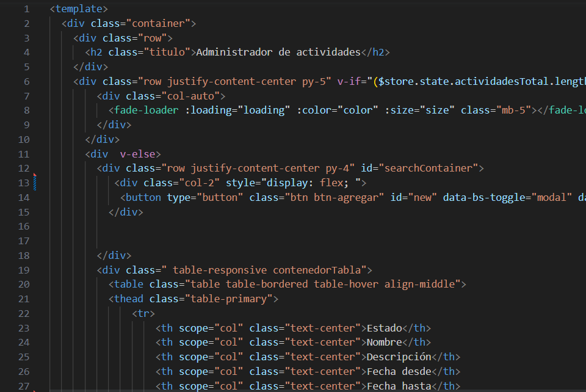
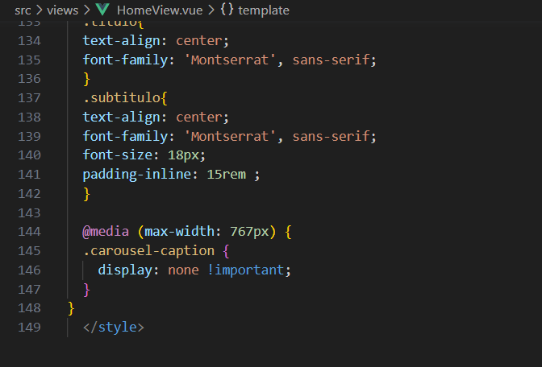
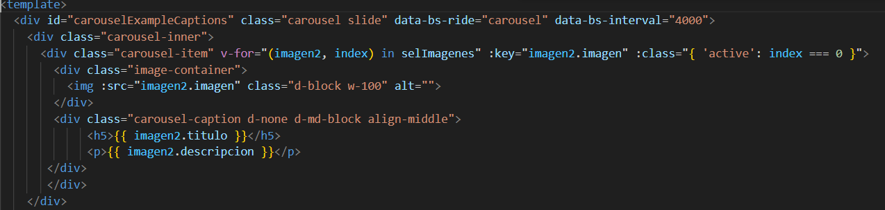
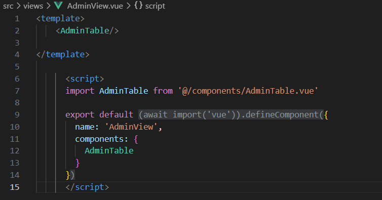
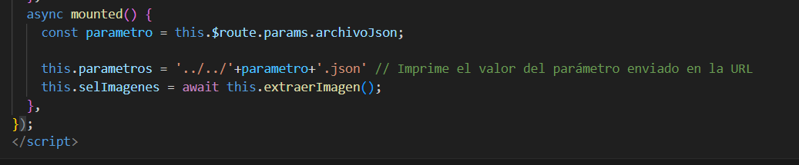
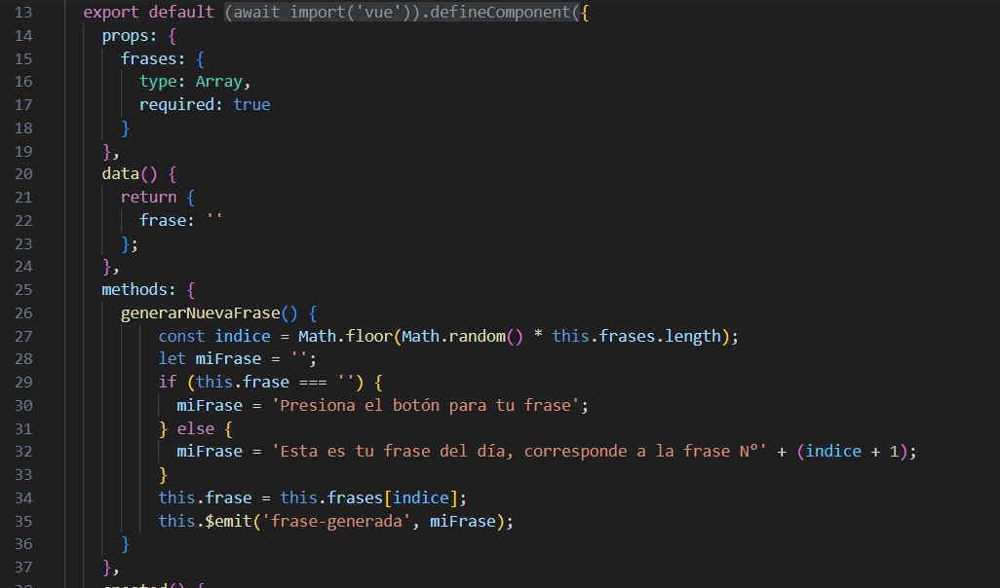
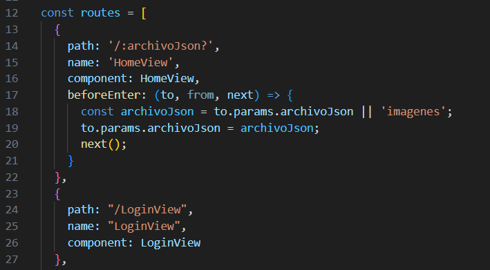

# Mujeres Aventureras
Este es el archivo README del portafolio del proyecto Mujeres Aventureras para inscripcion en distintas actividades, y así poder  optar por la insignia de talento digital.

## introducción
"Mujeres Aventuras" es un proyecto enfocado en ofrecer experiencias de senderismo y otras actividades relacionadas con la naturaleza. Nuestro objetivo principal es brindar la oportunidad a la comunidad de participar en estas actividades, fomentando el espíritu aventurero y el disfrute de la naturaleza. A través de la organización y creación de diversas actividades, buscamos inspirar y empoderar a las mujeres para que exploren entornos naturales, promoviendo así un estilo de vida saludable y la conexión con el medio ambiente. Nuestra labor consiste en facilitar y hacer accesible estas experiencias para que cualquier persona interesada pueda inscribirse y disfrutar de ellas.

## Requerimientos del usuario
Desarrollar una plataforma que le permita al usuario, conocer datos fundamentales a la hora de montar un proyecto
fotovoltaico como lo son los paneles solares.

## Requerimientos del sistema
Autenticación: Utiliza el servicio de autenticación de Firebase para implementar el sistema de login y logout. Puedes aprovechar las funcionalidades de Firebase Authentication para gestionar la autenticación de usuarios de forma segura.<br/>

Gestión de actividades: Utiliza Firebase Firestore para almacenar y administrar los datos de las actividades. Puedes crear una colección en Firestore llamada "actividades" donde cada documento represente una actividad específica. Guarda los detalles de cada actividad, como descripción, fechas, ubicaciones, etc., dentro de los documentos correspondientes.<br/>

Mantenedor de actividades: Utiliza la API de Firebase Firestore para realizar operaciones de creación, edición y eliminación de actividades desde la aplicación. Puedes utilizar formularios o interfaces de usuario para permitir a los administradores del proyecto gestionar las actividades de manera intuitiva.<br/>

Informes de actividades: Utiliza Firebase Firestore para almacenar y consultar los datos necesarios para generar los informes de actividades. Puedes crear consultas y filtros en Firestore para obtener los datos relevantes, como la participación de usuarios, rendimiento de actividades, etc. Luego, puedes procesar esos datos y generar los informes según los requisitos específicos.<br/>

Frase del día: Puedes almacenar una colección en Firestore llamada "frasesMotivacionales" que contenga una frase por cada día. Puedes programar una función en Firebase Cloud Functions para que se ejecute diariamente y actualice la frase del día en la página principal de tu proyecto.<br/>

-La opcion de Admninistracion solo debe estar visible para la cuenta de administrador si un usuario intenta acceder esta accion le sera denegada.<br/>


## 1 - Experiencia de uso
EL Proyecto se encuentra sin errores de ejecucion en consola, como se podra observar en el inspector, no existen problemas de navegacion, la presentacion y aspecto del sitio quedara a criterio del evaluador.

## 2 - Completitud del entregable
El entregable del proyecto "Mujeres Aventuras" basado en Firebase constará de una aplicación web o móvil que cumplirá con los siguientes requisitos:<br/>

Autenticación: Los usuarios podrán registrarse, iniciar sesión y cerrar sesión en la plataforma utilizando Firebase Authentication. Esto garantiza la seguridad y la gestión de acceso a las funcionalidades del sistema.<br/>

Actividades: La plataforma permitirá a los administradores crear, editar y eliminar actividades relacionadas con senderismo y otras actividades al aire libre. Estos datos se almacenarán en Firebase Firestore, lo que facilitará su gestión y consulta.<br/>

Mantenedor de actividades: Los administradores podrán acceder a un panel de administración intuitivo donde podrán agregar, modificar o eliminar actividades. Utilizando Firebase Firestore, se podrán actualizar los detalles de cada actividad, como su descripción, fechas, ubicaciones y otros datos relevantes.<br/>

Informes de actividades: La plataforma proporcionará informes sobre las actividades realizadas. Utilizando Firebase Firestore, se recopilarán los datos necesarios, como la participación de los usuarios y el rendimiento de las actividades. Estos informes podrán generarse y visualizarse de manera clara y precisa, brindando una visión general del éxito de las actividades.<br/>

Frase del día: La plataforma presentará una frase motivacional o inspiradora en la página principal, la cual se actualizará diariamente. Utilizando Firebase Firestore y Firebase Cloud Functions, se programará una función que se ejecute automáticamente cada día y actualice la frase del día en la plataforma.<br/>

En conclusión, el entregable del proyecto será una plataforma basada en Firebase que permitirá a los usuarios registrarse, participar en actividades al aire libre y disfrutar de una experiencia motivadora. La gestión de actividades, los informes y la frase del día serán aspectos clave en la plataforma, brindando a los usuarios una experiencia completa y enriquecedora en el mundo de las aventuras al aire libre.<br/>

## 3 - Utilización de tags html
En todos los componentes (que no son modales de bootstrap) se utiliza tags html con semantica acorde al standar HTML5 como: main/article/section/figcaption/div/img/ul/li/nav/header/footer.<br/>
 <br/>
[src/components/AdminTable.vue](src/components/AdminTable.vue)-- Linea 1 --<br/> 

## 4 - Responsividad
El proyecto es responsivo en su totalidad, se adapta a todo tipo de dispositivos, existe el uso de 
media queries de css en la vista de HomeView.vue y comportamiento responsivo con bootstrap con la utilizacion de breakpoints, esto se puede visualizar en el componente HomeView linea 144.<br/>
<br/> 
[src/views/HomeView.vue](src/views/HomeView.vue)<br/> 

## 5-Utilizacion de un framework de css
Se utilizo bootstrap en la gran mayoria del proyecto visualizado en componentes como el siguiente<br/>   
<br/>
[src/componentsviews/HomeView.vue](src/views/HomeView.vue) --linea 5--<br/> 

## 6 -Código mantenible mediante componentes
Estructura vue CLI mediante componentes y SPA <br/>  
<br/>
[src/views/AdmView.vue](src/views/AdminView.vue) --linea 12

## 7- Utilizacion de los metodos del ciclo de vida de un componente
Se implemento el uso de ciclo de vida mounted/created en algunos de los componentes<br/>
<br/>
[src/views/HomeView.vue](src/views/HomeView.vue) --linea 63--

## 8-Comunicacion entre componentes
Se utilizo tanto emits como props en alguno de los componentes<br/>
<br/>
[src/components/FraseAleatoria.vue](src/components/FraseAleatoria.vue) --linea 14-35--<br/>

## 9-Utilizacion de buenas practicas en la definicion de rutas
Nombres descriptivos para las rutas  <br/>
<br/>
[src/router/index.js](src/router/index.js) --linea 14/n--<br/>

Parametro por URL <br/> 
<br/>
[src/router/index.js](src/router/index.js) --linea 18/n--<br/>

Rutas por defecto  <br/>
<br/>
[src/router/index.js](src/router/index.js) --linea 48/n--<br/>


## 10- Utilizacion de sintaxis basica JavaScript
Utilizacion de declaracion de variables y metodos de formateo en javascript
<br/>
[src/views/CoursesView.vue](src/views/CoursesView.vue) --linea 242/265--<br/>

## 11- Utilizacion de Javascript es6/7 para resolver un problema
Se utiliza es6 en el proyecto en la gran mayoria de los componentes<br/>  
<br/>
[src/views/CoursesView.vue](src/views/CoursesView.vue) --linea 242/265--<br/>
 
## 12- Consumo API
Se utiliza el consumo de una API que proporciona los valores de indicadores economicos
se manejan errores en cualquier caso<br/>
<br/>
[src/views/CoursesView.vue](src/views/CoursesView.vue) --linea 415/429--<br/>

## 13-Estados internos de los componentes web
Utilizacion de estado de objeto data dentro del componente (error/stateMsg)
<br/>
[src/views/CoursesView.vue](src/views/CoursesView.vue) --linea 166/168--<br/>

<br/>
[src/views/CoursesView.vue](src/views/CoursesView.vue) --linea 93/98--<br/>

## 14- Maneja el estado de la aplicación con Vuex
Manejo de estados y consumo de servicio REST por medio de estructura de Vuex action<br/>
<br/>
[src/views/CoursesView.vue](src/views/CoursesView.vue) --linea 415/429--<br/>

## Project setup
```
npm install
```

### Compiles and hot-reloads for development
```
npm run serve
```

### Compiles and minifies for production
```
npm run build
```

### Lints and fixes files
```
npm run lint
```

### Customize configuration
See [Configuration Reference](https://cli.vuejs.org/config/).
